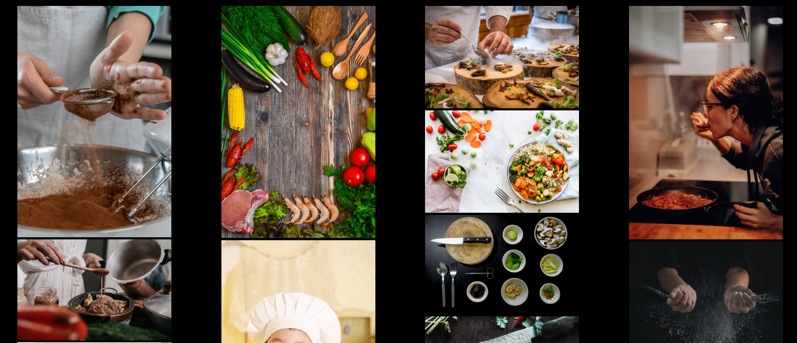
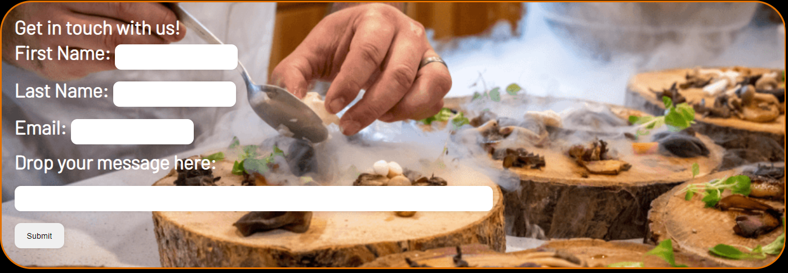

# Cooking Academy 
Cooking Academy is a website destined to a culinary school that facilitates user who have interest to get in touch with the company. 
Providing information about teachers, pictures of dishes made through the course and etc.  

[(assets/Images/mocup.png)]
## Design

### Wireframes

This is how I was planning my website to look like. 
 
Home page
  

  

## Features 

In this section, you should go over the different parts of your project, and describe each in a sentence or so. You will need to explain what value each of the features provides for the user, focusing on who this website is for, what it is that they want to achieve and how your project is the best way to help them achieve these things.

### Existing Features

- __Navigation Bar__

  - The website contains four pages, the full responsive navigation bar that includes links to access Home, Sign up Form, Teachers Session, Gallery.
  The navigation bar is the same and also interactive for all 4 pages.
  <ol>
    <li>Cooking Academy - logo </li>
    <li>Menu</li>
<ul>
        <li>Home - it is the main page</li>
        <li>Teachers - gallery with information about the teachers </li>
        <li>Contact Us - form for the user get in touch with the the academy.</li>
        <li> Gallery - gallery with pictures related to the course. </li>
</ul>
 
 

- __Hero Image and Logo__

  - The landing includes Cooking Academy logo that is relevant for the business related to cooking and also some information about where its located and thats a school that has good chefs teaching.  
  - Catches the user attention due to the vibrant color that focus on a very vivid yellow. 

- __Main Section on First Page__

 - User sees some information about the page and how important cooking is even for daily tasks and also for recreative reasons to do it. 
 

- __Chefs section__

  - This section shows some pictures of people cooking and even kids doing it to incentivize the user that no matter what age you are, you can cook ! 

 

- __The Footer__ 

  - The footer contains social feature that link the page to Instagram, Facebook, Twitter.
  - This will allow the users to follow Cooking Classes on social media to keep up to date with things that might not be on our website. 

- __Gallery__

  - This section contains pictures of dishes and people cooking to show a bit of what the experience can be because cooking is colorful and so much fun !!

- __The Sign Up Page__

  - This page will allow the user to get in touch with people from Cooking Academy and start the journey of learning how to cook. 

### Features Left to Implement

- Another feature idea
- User reviews and map on first page.

## Testing 

If this section grows too long, you may want to split it off into a separate file and link to it from here.

- My website was taking very long time to load so I had to convert and compress all my photos in order to make it work. 
- I wasn able to align my gallery pictures so I learnt how to sue display boxes and made it work on mobiles as well.
- While creating and website and deploying I found out I Needesd to remove the "/" from my links cause it was causing an error while trying to open images through absolute paths. 

### Validator Testing 

- HTML
  - No errors were returned when passing through the official [W3C validator](https://validator.w3.org/nu/?doc=https%3A%2F%2F8000-helenbeatriz-p1htmlcss-z79k9ftjie2.ws-eu64.gitpod.io%2F) 
- CSS
  - No errors were found when passing through the official [(Jigsaw) validator](https://jigsaw.w3.org/css-validator/validator?uri=https%3A%2F%2F8000-helenbeatriz-p1htmlcss-z79k9ftjie2.ws-eu64.gitpod.io%2F&profile=css3svg&usermedium=all&warning=1&vextwarning=&lang=en)

## Deployment

This section should describe the process you went through to deploy the project to a hosting 

- The site was developed to GitHub pages. The steps to deploy are as follows: 
  - In the GitHub repository, navigate to the Settings tab 
  - From the source section drop-down menu, select the Master Branch
  - Once the master branch has been selected, the page will be automatically refreshed with a detailed ribbon display to indicate the successful deployment. 

The live link can be found here - https://helenbeatriz.github.io/Cookingacademy-P1/
## Credits 

All the pictures/media are owned by Pexels.
I did the whole website based on the things I learnt through the course, watching videos on Youtube and mixing then and creating my own. 

### Content 

- Footer icons were taken from FontAwsome. https://fontawesome.com/

### Media

- All the pictures/media are owned by Pexels. https://www.pexels.com/
